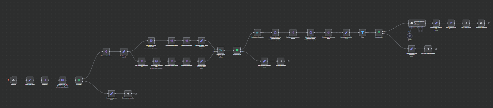

# 📍 Job Searching

This n8n workflow helps professionals identify nearby companies of interest based on role, industry, and company filters. It calculates commuting distances and provides AI-generated networking tips for each match.
## 🚀 Project Purpose
Designed for individuals looking for job opportunities in their proximity, this workflow:
- Geolocates multiple user-defined start addresses.
- Searches for specific companies in scecific areas within a specific radius.
- Prioritizes results from specific companies if needed.
- Calculates driving/transit distances to offices.
- Sorts and filters companies by proximity.
- Uses AI (OpenAI/GPT-4) to generate short, actionable career tips for each company.
